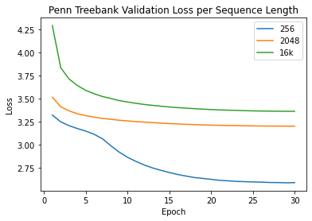

# Efficient Transformers

## Code Structure

## Task and Datasets

## Transformer-XL

Trained models with 8, 12, and 16 layers each with 8 attention heads. Models were trained with 10% droppout, learning rate 0.00025 and optimized with adam.

Models were trained on a NVIDIA RTX 2060. 

Note that for WikiText-2 due to memory constraints on the gpu we were only able to use a 15 layer model for our "large" model as opposed to the 16 layer models used for the other two datasets.
We also notice that while the large models do perform better the difference in performance is marginal. 
We observe very strange behavior with the 16 layer model on the Penn Tree Bank dataset. We retrained this model multiple times and adjusted model parameters all of which had little to no signifcant effect. We are currently unsure why this model performs like this and will need to investigate further.

##### Testset Results
|   | Perplexity | Avg ms/batch | 
|---|---|---|
|  EnWik8_8 | 4.705 | 234.76 |  
|  EnWik8_12 | 4.416 | 470.15  |  
|  EnWik8_16 | **4.393** | 472.20  |
|  WikiText-2_8 | 133.080 | 296.99 |
|  WikiText-2_12 | 126.021 | 387.55 |
|  WikiText-2_15 | **123.108** | 495.67 |
|  PTB_8 | 96.605 | 248.05 |
|  PTB_12 | **91.249** | 360.85 |
|  PTB_16 | 651.929 | 490.60 |

## Sparse Transformer

## Compressive Transformer

Our base model had 8 layers with 8 attention heads. The memory and compressed memory sizes match the sequence length, which was 512. We used the compressed memory ratio recommended in the paper, which was 4.

We optimized the model using Adam with a learning rate of 1e-4.

### Sequence Length

Somewhat puzzlingly, using a sequence length of 2048 took four times as a long to train as our base model of 512, yet smaller sequence lengths trained in approximately the same amount of time as base.

Overall, sequence length did not affect performance significantly. We see that only for enwik8 did having a long sequence length improve performance. For the other two datasets, sequence lengths of 128 to 512 performed well comparably. The reason a longer sequence length performs worse could possibly be explained by the fact that there are little dependencies between words that are so far apart. Only for character level modeling are there any meaningful dependencies. On the other hand, shorter sequence lengths hide information that could be helpful in processing the current tokens.

### Model Depth

Training time correlated linearly with model depth.

We see trends that are similar to the ones for sequence length. Performance was again not affected very much.

## Reformer
Reformer is a highly memory efficient transformer model. In these experiments, Axial Position Encodings were not used, as the Huggingface implementation of fine tuning a pretrained model did not offer straightforward compatibility with the the axial encodings activated (requiring sequence lengths of 500k tokens). Therefore, the model was tuned and tested on sequence lengths of 256, 2048, and 16k tokens, as longer sequences were not feasible due to memory limitations. The experiments demonstrated that typically, an increase in sequence length leads to faster training times at the cost of higher perplexity upon evaulation. 

A pretrained Reformer model was used, specifically a variant trained by Google AI on an English translation of the novel Crime and Punishment by Fyodor Dostoyevsky. This model uses subword level tokenization, and the tokenizer trained on the same text was used for all experiments. While the model was tuned on the training sets, the tokenizer was not tuned on the datasets, thus using a fixed vocabulary across all experiments. This approach was selected to hold as many variables constant while experimenting with different sequence lengths.  

Training performed in Google Colab. 
### Evaluation Perplexity
| Seq Len  | wt2 | ptb | ew8 |
|---|---|---|---|
|  256 | 14.49 | **13.29**  |  67.08 |
|  2048 | 26.18 |  **24.54** |  32.99 |
|  16384 | 29.33  | 28.84  |  **24.92** |
### Training Runtime
| Seq Len  | wt2 | ptb | ew8 |
|---|---|---|---|
|  256 | 1:11:32.24 | 0:29:33.46  |  7:05:43.91 |
|  2048 | 0:33:10.46 |  0:13:24.65 |  4:07:58.78 |
|  16384 | 0:26:46.93  | 0:09:41.03  |  2:59:54.07 |

## Transformers are RNNs

## Conclusions

##### Aggregate Preplexity Results

|   | EnWik8 | WikiText-2 | Penn Tree Bank | 
|---|---|---|---|
|  Transformer-XL | 4.393 | 123.108 | 91.249 |
|  Sparse Transformer |  |  |  |
|  Compressive Transformer |  |  |  |
|  Reformer | 24.92 | 14.49 | 13.29 |
|  Transformers are RNNs |  |  |  |

## Reference

Transformer-XL code is based on [this repo](https://github.com/kimiyoung/transformer-xl)  
https://huggingface.co/blog/reformer  
https://huggingface.co/transformers/training.html    
https://huggingface.co/transformers/perplexity.html
