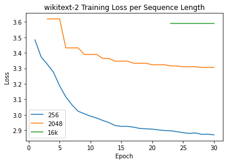
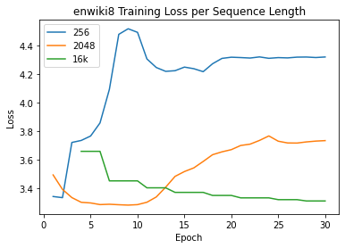
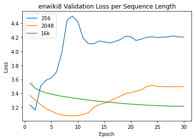

# Efficient Transformers

## Code Structure

## Task and Datasets  
### Causal Language Modeling 
Causal Language modeling consists of predicting the next token in a sequence of tokens. 
### enwik8  
### Penn Treebank  
The English Penn Treebank (PTB) corpus, and in particular the section of the corpus corresponding to the articles of Wall Street Journal (WSJ), is one of the most known and used corpus for the evaluation of models for sequence labelling. The task consists of annotating each word with its Part-of-Speech tag. In the most common split of this corpus, sections from 0 to 18 are used for training (38 219 sentences, 912 344 tokens), sections from 19 to 21 are used for validation (5 527 sentences, 131 768 tokens), and sections from 22 to 24 are used for testing (5 462 sentences, 129 654 tokens). The corpus is also commonly used for character-level and word-level Language Modelling.  
### WikiText-2  
The WikiText language modeling dataset is a collection of over 100 million tokens extracted from the set of verified Good and Featured articles on Wikipedia. Compared to the preprocessed version of Penn Treebank (PTB), WikiText-2 is over 2 times larger. The WikiText dataset also features a far larger vocabulary and retains the original case, punctuation and numbers - all of which are removed in PTB. As it is composed of full articles, the dataset is well suited for models that can take advantage of long term dependencies.

## Transformer-XL

Trained models with 8, 12, and 16 layers each with 8 attention heads. Models were trained with 10% droppout, learning rate 0.00025 and optimized with adam.

Models were trained on a NVIDIA RTX 2060. 

Note that for WikiText-2 due to memory constraints on the gpu we were only able to use a 15 layer model for our "large" model as opposed to the 16 layer models used for the other two datasets.
We also notice that while the large models do perform better the difference in performance is marginal. 
We observe very strange behavior with the 16 layer model on the Penn Tree Bank dataset. We retrained this model multiple times and adjusted model parameters all of which had little to no signifcant effect. We are currently unsure why this model performs like this and will need to investigate further.

##### Testset Results
|   | Perplexity | Avg ms/batch | 
|---|---|---|
|  EnWik8_8 | 4.705 | 234.76 |  
|  EnWik8_12 | 4.416 | 470.15  |  
|  EnWik8_16 | **4.393** | 472.20  |
|  WikiText-2_8 | 133.080 | 296.99 |
|  WikiText-2_12 | 126.021 | 387.55 |
|  WikiText-2_15 | **123.108** | 495.67 |
|  PTB_8 | 96.605 | 248.05 |
|  PTB_12 | **91.249** | 360.85 |
|  PTB_16 | 651.929 | 490.60 |

## Sparse Transformer

## Compressive Transformer

Our base model had 8 layers with 8 attention heads. The memory and compressed memory sizes match the sequence length, which was 512. We used the compressed memory ratio recommended in the paper, which was 4.

We optimized the model using Adam with a learning rate of 1e-4.

### Sequence Length

Somewhat puzzlingly, using a sequence length of 2048 took four times as a long to train as our base model of 512, yet smaller sequence lengths trained in approximately the same amount of time as base.

| Seq Len | EnWik8 | WikiText-2 | PTB |
|---|---|---|---|
|  64 | 5.627 | 177.71 | 138.23 |
|  128 | 4.860 | 163.61 | 119.79 |
|  256 | 4.604 | 150.11 | **96.67** |
|  512 | 4.233 | 147.29 | 131.90 |
|  1024 | 4.084 | **119.60** | 123.93 |
|  2048 | **3.831** | 184.58 | 140.77 |

Overall, sequence length did not affect performance significantly. We see that only for enwik8 did having a long sequence length improve performance. For the other two datasets, sequence lengths of 128 to 512 performed well comparably. The reason a longer sequence length performs worse could possibly be explained by the fact that there are little dependencies between words that are so far apart. Only for character level modeling are there any meaningful dependencies. On the other hand, shorter sequence lengths hide information that could be helpful in processing the current tokens.

### Model Depth

Training time correlated linearly with model depth.

We see trends that are similar to the ones for sequence length. Performance was again not affected very much.

## Reformer
Reformer is a highly memory efficient transformer model. In these experiments, Axial Position Encodings were not used, as the Huggingface implementation of fine tuning a pretrained model did not offer straightforward compatibility with the the axial encodings activated (requiring sequence lengths of 500k tokens). Therefore, the model was tuned and tested on sequence lengths of 256, 2048, and 16k tokens, as longer sequences were not feasible due to memory limitations. The experiments demonstrated that typically, an increase in sequence length leads to faster training times at the cost of higher perplexity upon evaulation. 

A pretrained Reformer model was used, specifically a variant trained by Google AI on an English translation of the novel Crime and Punishment by Fyodor Dostoyevsky. This model uses subword level tokenization, and the tokenizer trained on the same text was used for all experiments. While the model was tuned on the training sets, the tokenizer was not tuned on the datasets, thus using a fixed vocabulary across all experiments. This approach was selected to hold as many variables constant while experimenting with different sequence lengths.  

Training performed in Google Colab. 
### Evaluation Perplexity
| Seq Len  | wt2 | ptb | ew8 |
|---|---|---|---|
|  256 | 14.49 | **13.29**  |  67.08 |
|  2048 | 26.18 |  **24.54** |  32.99 |
|  16384 | 29.33  | 28.84  |  **24.92** |
### Training Runtime
| Seq Len  | wt2 | ptb | ew8 |
|---|---|---|---|
|  256 | 1:11:32.24 | 0:29:33.46  |  7:05:43.91 |
|  2048 | 0:33:10.46 |  0:13:24.65 |  4:07:58.78 |
|  16384 | 0:26:46.93  | 0:09:41.03  |  2:59:54.07 |

## Transformers are RNNs: Fast Autoregressive Transformers with Linear Attention
The model is based on [this paper](https://arxiv.org/pdf/2006.16236.pdf).

We borrow the code for model from [this repo](https://github.com/idiap/fast-transformers) and some preprocessing code from [pytorch tutorial](https://pytorch.org/tutorials/beginner/transformer_tutorial.html).

### Experiments 
- Hyperparameters
  - Different batch size
  - Different learning rates
- Number of parameters
  - Different numbers of layers
  - Different numbers of attention heads
- Linear attention v.s. full attention 
- Varying sequence length

### Results on Hyperparameters
#### Varying Batch Size
From the figure, we can see that batch size=16 yield the best results. For WikiText2 and PennTreebank, there is not a big difference between batch size of 16 and 64; for Enwik8, there is little difference between batch size of 4 and 16. When batch size is too small, the gradient step each update is too random and might not lead the parameters to a good local minimum. When the batch size is too large, one possible reason for its inferior performance is the number of examples becomes smaller if we train for equal number of epochs.

#### Varying Learning Rate
We can see that the learning rate of 0.00005 is the best across the two datasets (WikiText2 and PennTreebank). Due to the training time, we just use the best learning rate (5e-5) for enwik8.  

**WikiText2**

**PennTreebank**

### Results on Number of Parameters
We try to vary the number of parameters, which affects the capacity of the model. We experiment with models of 2, 5, 8, 11 layers and observe how these models perform on the end tasks. 

#### Varying Number of Layers
As the model becomes deeper, the perplexity tends to decrease. This indicates that larger model capacity can enhace model performance. 

### Comparison of Attention Type
As can be seen in the figure below, different attention types seem not to affect the result too much (see the scale). Note here we use the best-performing hyperparameters on linear attention models, but we can assuem the two models would performa similarly when carefully tuned. On language modeling tasks, transformer with linear attention does not sacrifice performance.

### Comparison of Sequence Length
For WikiText2 and PennTreebank dataset, shorter sequence length seems to bring better results. One possible reason is that for longer texts, the transformer might need to encode longer dependency, which can be more complicated for a medium-sized model (only 8 layers). For enwik8, longer sequences give better result. We think the reason is that this is a character-level language modeling dataset, which might need longer dependency to determine the next character. (e.g. 250 characters might only be about 30 words)

## Conclusions

##### Aggregate Preplexity Results

|   | EnWik8 | WikiText-2 | Penn Tree Bank | 
|---|---|---|---|
|  Transformer-XL | 4.393 | 123.108 | 91.249 |
|  Sparse Transformer |  |  |  |
|  Compressive Transformer | 3.831 | 119.601 | 96.665 |
|  Reformer | 24.92 | 14.49 | 13.29 |
|  Transformers are RNNs | 3.49 | 167.51 | 133.34 |

## Reference

Transformer-XL code is based on [this repo](https://github.com/kimiyoung/transformer-xl)  
https://huggingface.co/blog/reformer  
https://huggingface.co/transformers/training.html    
https://huggingface.co/transformers/perplexity.html
