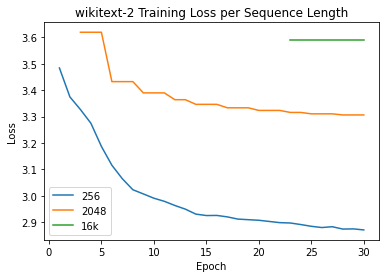
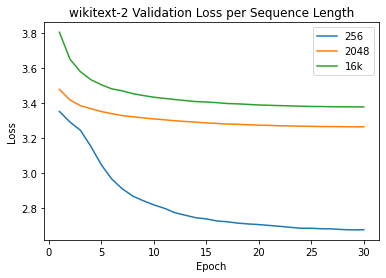
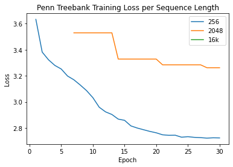
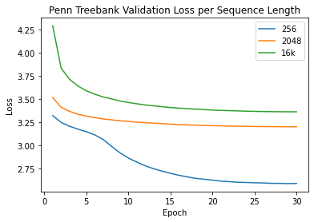
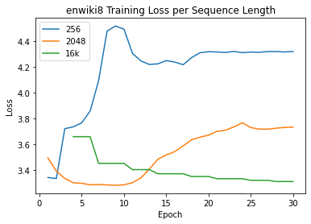
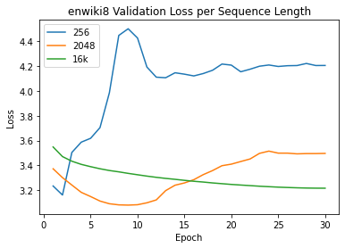

# Reformer

## Model Architecture & Hyperparams
* 6-layer  
* 256-hidden  
* 2-heads  
* 3M parameters   
* Adafactor optimizer
* Learning Rate: 0.0002    
* Weight Decay: 0.01
* Batch Size: 16
* Epochs: 30 

## Task and Datasets
* Causal language Modeling  
* wikitext-2 | penn treebank | enwik8  
* Trained using Google Colab Pro  

## Summary  
Reformer is a highly memory efficient transformer model. In these experiments, Axial Position Encodings were not used, as the Huggingface implementation of fine tuning a pretrained model did not offer straightforward compatibility with the the axial encodings activated (requiring sequence lengths of 500k tokens). Therefore, the model was tuned and tested on sequence lengths of 256, 2048, and 16k tokens, as longer sequences were not feasible due to memory limitations. The experiments demonstrated that typically, an increase in sequence length leads to faster training times at the cost of higher perplexity upon evaulation. 

A pretrained Reformer model was used, specifically a variant trained by Google AI on an English translation of the novel Crime and Punishment by Fyodor Dostoyevsky. This model uses subword level tokenization, and the tokenizer trained on the same text was used for all experiments. While the model was tuned on the training sets, the tokenizer was not tuned on the datasets, thus using a fixed vocabulary across all experiments. This approach was selected to hold as many variables constant while experimenting with different sequence lengths. 

## Results  
NOTE: Sequence Length of 512 instead of 256 used for enwik8 due to training time. (> 24hr)
### Evaluation Perplexity
| Seq Len  | wt2 | ptb | ew8 |
|---|---|---|---|
|  256 | 14.49 | **13.29**  |  67.08 |
|  2048 | 26.18 |  **24.54** |  32.99 |
|  16384 | 29.33  | 28.84  |  **24.92** |

### Training Metrics per Sequence Length
#### Training Runtime
| Seq Len  | wt2 | ptb | ew8 |
|---|---|---|---|
|  256 | 1:11:32.24 | 0:29:33.46  |  7:05:43.91 |
|  2048 | 0:33:10.46 |  0:13:24.65 |  4:07:58.78 |
|  16384 | 0:26:46.93  | 0:09:41.03  |  2:59:54.07 |

#### Training Speed
| Seq Len  | Steps/sec |
|---|---|
|  256 | ~ 10.1 |
|  2048 | ~ 2.7 |
|  16384 | ~ 0.4  |

#### Sample Speed
| Seq Len  | Samples/sec |
|---|---|
|  256 | ~ 161 |
|  2048 | ~ 43 |
|  16384 | ~ 6  |






  

## Memory Benchmark Tests  
### Model Architectures  
#### Reformer
* 6-layer  
* 256-hidden  
* 2-heads  
* 3M parameters   
* Trained on English text: Crime and Punishment novel by Fyodor Dostoyevsky.  

#### Reformer
* 12-layer  
* 1024-hidden  
* 8-heads  
* 149M parameters   
* Trained on English Wikipedia data - enwik8.    

#### GPT2 Base
* 12-layer  
* 768-hidden  
* 12-heads  
* 117M parameters   
* OpenAI GPT-2 English model     

### Reformer C/P - Without Axial Position Encodings
```
====================      INFERENCE - MEMORY - RESULT       ====================
--------------------------------------------------------------------------------
          Model Name             Batch Size     Seq Length    Memory in MB 
--------------------------------------------------------------------------------
         Reformer C/P                16             256             1523     
         Reformer C/P                16             512             1603     
         Reformer C/P                16             2048            2055     
         Reformer C/P                16            16384            6327     
--------------------------------------------------------------------------------
```  

### Reformer C/P - With Axial Position Encodings
```
====================      INFERENCE - MEMORY - RESULT       ====================
--------------------------------------------------------------------------------
          Model Name             Batch Size     Seq Length    Memory in MB 
--------------------------------------------------------------------------------
         Reformer C/P                16             256             1015     
         Reformer C/P                16             512             1095     
         Reformer C/P                16             2048            1551     
         Reformer C/P                16            16384            6057     
--------------------------------------------------------------------------------
``` 

### Reformer en8 - Without Axial Position Encodings
```
====================      INFERENCE - MEMORY - RESULT       ====================
--------------------------------------------------------------------------------
          Model Name             Batch Size     Seq Length    Memory in MB 
--------------------------------------------------------------------------------
         Reformer en8                16             256             2197     
         Reformer en8                16             512             5079     
         Reformer en8                16             1024            8407     
         Reformer en8                16             2048           15063     
--------------------------------------------------------------------------------
``` 

### GPT2 Base 
```
====================      INFERENCE - MEMORY - RESULT       ====================
--------------------------------------------------------------------------------
          Model Name             Batch Size     Seq Length    Memory in MB 
--------------------------------------------------------------------------------
          GPT2 Base                  16             256             3063     
          GPT2 Base                  16             512             4761     
          GPT2 Base                  16             1024            8827     
          GPT2 Base                  16             2048            N/A      
--------------------------------------------------------------------------------
```


## Reference
Pretrained model, tokenizer, and examples sourced from Huggingface.  
https://huggingface.co/blog/reformer  
https://huggingface.co/transformers/training.html    
https://huggingface.co/transformers/perplexity.html
